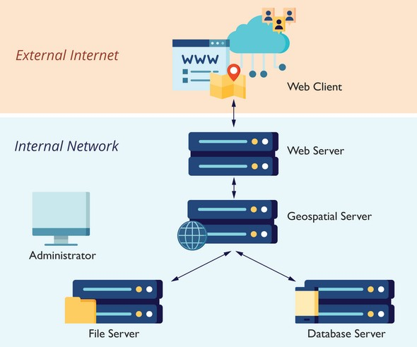

# Analysis on ICAO Coronavirus 3DFX dispersion

_This essay was created for GEOG 458 with Bo Zhao at the University of Washington_

## Table of Contents

  - [Introduction](#intro)
  - [System Architecture](#sa)
      - [Potential Data Flow](#potential-data-flow)
  - [Project Internals](#pi)
      - [Client & Server Communication](#client--server-communication)
  - [Data Sources / Thematic Layers](#ds)
      - [Coronavirus](#coronavirus--)
      - [Air Traffic and Flight Waves ](#air-traffic-and-flight-waves--)
  - [Project Externals](#pe)
    - [Elements](#elements)
    - [Features](#features)
  - [Analysis](#analysis)
    - [Strengths and Weaknesses](#strengths-and-weaknesses)
    - [Final Thoughts](#final-thoughts)
  - [Attributions and References](#attributions-and-references)

---

##  &nbsp; Introduction <a id="intro"></a>

The following essay will be an analysis on a digital geography project. Following this introduction there are several sections that include information on the map internal and externals, data used, system architecture, and final thoughts on the strengths, weaknesses, and other aspects of the map. This web map, _ICAO Coronavirus 3DFX dispersion_ was made by **Gilbert Lasnier**, an aeronautical GIS officer at the International Civil Aviation Organization (ICAO).
> The [ICAO](https://www.icao.int/about-icao/Pages/default.aspx) is an agency that focuses on the planning and development of international air transport. The group works with UN members to enact policies in support of a safe, efficient, secure, economically sustainable and environmentally responsible civil aviation sector.


### ICAO Coronavirus 3DFX dispersion [(view map)](https://www.arcgis.com/apps/webappviewer3d/index.html?id=d9d3f8fa9a23425c8f0889baab626186)


&nbsp;

The goal of this web map is to display COVID-19 data in a novel way through the use of 3D mapping. Further differing the perspective on this data that has been mapped by many groups, this map intends to show the evolution of the Coronavirus across the world through air traffic data layers and unique visualizations that take advantage of the 3D view. Although this map is targeted at a general audience interested in educating themselves on COVID-19 statistics in a new way, many of the features require some understanding of navigating ArcGIS applications. Perhaps individuals with more experience in GIS is an audience better fit for this map.

&nbsp;

##  &nbsp; System Architecture <a id="sa"></a>

&nbsp;

&nbsp;

Through the url linked above, anyone who has access to the internet can view this map by pasting the link in their preferred browser. This thin web client has direct communication with ESRI servers to be able to request the map created in ArcGIS Pro which is translated by ESRI to be displayed though HTML, CSS, and Javascript. ArcGIS Pro is heavy duty software used to consolidate this data into the map that we can now interact with. ESRI has their own database servers that they allow administrators to use to store their data with a payed credit system. ArcGIS acts as the geospatial server, performing operations such as drawing maps, sharing, and processing geospatial data.

#### Potential Data Flow

The flow of data might be _something_ like the following: The map creators (ICAO) use ArcGIS Pro to build a global [web scene](https://doc.arcgis.com/en/arcgis-online/reference/what-is-web-scene.htm) on their personal workstations. The data from this project is uploaded to ESRI database servers and the project is hosted on ArcGIS Online and made public. When a user visits the web map on their browser through the url, data is requested by the client. From the ESRI database server the data travels to the geospatial server so that that map can be drawn and data can be processed, then this is passed to the web server (ArcGIS Online) to then communicate the data to the client to finally view.

> Again, the the specific stack is not mentioned by IAOC, however a typical GIS stack from ESRI involves these technologies:
>
> **Server:**
> - ArcSDE
> - ArcGIS Server
> - ArcGIS Webservice API
>
> **Client:**
> - ArcGIS Desktop/Online

&nbsp;

##  &nbsp; Project Internals <a id="pi"></a>

#### Client & Server Communication

Map tiles are fetched from the ESRI database as the user pans around the globe or zooms into to different areas. The picture below is a screenshot of the network tab in the Chrome Developer Tools. On the left is a list of the requests that the browser, or the web client, is making to the web server. The right shows the header for one of these requests including the url and the request type. A request is made to ArcGIS to get a new tile from the **Terrain3D** layer for dynamic rendering.

&nbsp;


The code for this project is not natively built with HTML, CSS, and Javascript, so it is difficult to look directly at the code and gain an understanding of how the map is created. When translating maps into HTML, CSS, and Javascript for the client's browser, ESRI uses their [ArcGIS API](https://developers.arcgis.com/) (as shown in the tech stack). Here the documentation can be read to gain a better understanding about what is happening under the hood. For example, a [WebTileLayer](https://developers.arcgis.com/javascript/latest/api-reference/esri-layers-WebTileLayer.html) was utilized to add map tiles onto the map as a layer. Below is an **example** code snippet of using an ESRI web tile layer inside of the client side code.

```javascript
<script src="https://js.arcgis.com/4.15/"></script>

<script>
  require([
    "esri/layers/WebTileLayer",
    "esri/Map",
    "esri/views/SceneView"
  ], function(WebTileLayer, Map, SceneView) {
    var map = new Map({
      ground: "world-elevation"
    });

    var view = new SceneView({
      container: "viewDiv",
      map: map,
      scale: 123456789,
      center: [-65, -15]
    });

    var tiledLayer = new WebTileLayer({
      urlTemplate:
        "https://stamen-tiles-{subDomain}.a.ssl.fastly.net/terrain/{level}/{col}/{row}.png",
      subDomains: ["a", "b", "c", "d"],
      copyright:
        'Map tiles by <a href="http://stamen.com/">Stamen Design</a>, ' +
        'under <a href="http://creativecommons.org/licenses/by/3.0">CC BY 3.0</a>. ' +
        'Data by <a href="http://openstreetmap.org/">OpenStreetMap</a>, ' +
        'under <a href="http://creativecommons.org/licenses/by-sa/3.0">CC BY SA</a>.'
    });

    map.add(tiledLayer);
  });
</script>
```

> On any device, the display will responsively adapt to better fit the user's interactions. While best viewed on a desktop, this map can be viewed on a mobile device.

&nbsp;

##  &nbsp; Data Sources / Thematic Layers <a id="ds"></a>

All data layers and and metadata can be found on the  [web map overview](https://icao.maps.arcgis.com/home/item.html?id=bf1ef9f8d9a748e0ab77c5591b24102e) on ICAO's ArcGIS Online account. _Note that this links to the web scene version of the web mapping application discussed in this essay._

#### Coronavirus -
This data in the table below relating to the COVID-19 virus comes from the following sources: **WHO, CDC, NHC, earlyAlert for Airport and Dingxiangyuan** which are updated daily. All data is in vector format.

| Data        | Description | Geometry Type      |
|    :----    |    :----    |    :----    |
| Ncov Cases Death| COVID-19 deaths based on state, province, region, or territory       | Point |
| Ncov Cases Confirmed | COVID-19 confirmed cases based on state, province, region, or territory        | Point    |
| Ncov Cases By Country  | COVID-19 confirmed cases by country        | Point    |
| RegionCases3D 9missing draft | 3D rendering of COVID-19 cases by region       | Polygon    |

#### Air Traffic and Flight Waves -
This next table of data includes route analysis information that comes from **ICAO Gilbert Lasnier**, the map's author. All data is in vector format.

| Data        | Description | Geometry Type      |
|    :----    |    :----    |    :----    |
| Airports Action | Airport response to COVID-19 around the world (restrictions, screening, suspended)       | Point |
| mov2018 wcountry 4016  | Frequency of flights from city within the country        | Point    |
| Traffic Wuhan 15 routes First wave inside China   | First wave of flights from Wuhan within China        | Polyline   |
| Traffic Wuhan 15 3D routes First wave inside China   | 3D representation of the previous data        | Polyline    |
| Traffic from Wuhan 95 Flights First Wave  | -        | Polyline    |
| Traffic_Japan_Second_wave  | Second wave flights from Japan        | Polyline    |
| Traffic_Thailand_Second_wave  | Second wave flights from Thailand        | Polyline    |
| Traffic_Republic_of_Korea_Second_wave  | Second wave flights from South Korea        | Polyline    |
| Traffic_2018_from_CHINA 233 greater 5000 km  | Flights from China greater than 5000 km        | Polyline    |
| Traffic_2018_from_CHINA 2,626 Flights  | Flights from China        | Polyline    |
| Flow2018_nbFlight2102-41005 mov | -        | Polyline    |
| Airport Code Flight Plan | -        | Point    |
| TrafficFlow2018simp003wcountryAll | -        | Polyline    |
| Copy Traffic Wuhan 15 routes First wave | Copy of first wave Wuhan flights        | Polyline   |
| CHN Province Contour | China province outlines        | Polygon    |
| CHN_Province_Boundary | China province areas        | Polygon    |
| Affected_Regions following the Second Wave | -        |  Polygon    |
| Index Nationality Airport 2 letter | -        | Polygon   |


**Basemap ->** [Nova basemap](https://www.arcgis.com/home/item.html?id=97f442bfd857486cbec2ee4e44a8b13a) is used as vector tile layer to give a futuristic look of the map with a dark background and glowing blue elements. The map also has a option to select from an a wide range of often used basemaps such as topographic, streets,openStreetMap, and more. However, to change the basemap the user must disable the Nova layer because as it is a default layer.

**Ground Layer ->** [WorldElevation3D/Terrain3D](https://www.arcgis.com/home/item.html?id=7029fb60158543ad845c7e1527af11e4) is a raster layer used to be able to do 3D mapping in ArcGIS applications. Any data that includes a z-index will be shown appropriately on this 3D model.

&nbsp;

##  &nbsp; Project Externals <a id="pe"></a>

### Elements

The initial elements on the web map are minimal as to not detract from the thematic layers described above. In the top left corner of the web app there are a few tiles for basic navigation. This includes a **home** button to go to the initial state of the map, a **location** button to travel to the user's current location on the map, a **navigate** button that toggles how the map changes on a click and drag (pan vs. angle), a **search** bar to immediately travel to a specific address or place, and finally a **zoom in** and **zoom out** button. The nav bar has the main functions in the upper right including the **legend**, **current feature menu** (such as a layer list, basemap gallery, etc.), and the available **features** as described in the next section.

### Features


&nbsp;

The above image lists all of the different features that this map has to offer:

- **Slides** is similar to a web map tour. Selecting this feature opens a list at the bottom of the screen that shows many critical locations during the pandemic such as the US, Wuhan, New York, Canada, Italy, Spain, and more. By clicking on one of these tiles, the user's view is moved to that location and layers are changed automatically. In the case of Wuhan, a 3D representation of region cases are shown.

  &nbsp;
  
  &nbsp;

- The next six features showing a circle icon with swirling lines on the feature menu all involve a video-like view. Moving or pulsing elements are mapped and after pressing a play button that appears in the bottom left corner, the globe will begin to slowly spin.

  - As previously mentioned, a key component of this web map is the inclusion of **air traffic** data. The first of these three features take advantage if this. Each shows a dynamic visual of the flights along these flight paths as shown the in this gif. _Note that this gif comes from only a visualization of the air traffic data and not the web map discussed in this document_

  &nbsp;
   

  &nbsp;

  - The next three features show cases around the world though a red bubble-like map that pulses so that smaller circles can be seen behind the larger circles. As well as 3D cylinders which has a height relative to the number of cases.

  &nbsp;

  

  &nbsp;

  

  &nbsp;

- The last four features don't seem to be as insightful as the aformentioned. These include **measurement** to determine the distance between two locations, **daylight** which is a neat feature that allows the user to change the direction that the light is hitting the globe and shadows are cast (though unnecessary), **share** which provides the link for embedding or sharing this map directly, and finally a **basemap gallery** to change the basemap.

&nbsp;

##  &nbsp; Analysis <a id="analysis"></a>

In the final section of this essay I will discuss my overall thoughts about the digital geography project.

### Strengths and Weaknesses

#### Strengths:

- **Refreshing Visual -** Since the COVID-19 pandemic has surprised the world, many dashboard, charts, graphs, and other such visualizations have been made. This 3D model not only provides a new perspective on a heavily visualized topic, but adds novel insight as it is the first in the world showing the airline routes of the virus from the primary infected region.

- **Multi-Functional -** Statistics about COVID-19 cases and deaths aren't the only points being mapped. A varying set of data is mapped through unique features such as the the flight paths, 3D regions, and bubble-grid.

#### Weaknesses:

- **Technical Limitations -** When attempting to view some of the layers that have a high number of points,they may only be partially drawn (ex. mov2018 data) because of limitations on number of features and symbol complexity that can be displayed on the map.

- **Undescriptive Layers -** Several of the layers have very unintuitive names such as _"mov2018 wcountry 4016"_ and aren't described at all in the web application, overview in ArcGIS Online, or the metadata. This causes the users to have to guess at the representation of the data or do research just to figure out what it is.

### Final Thoughts

**Digital Divide -**
This project is unique and provides a new perspective to building data that has been visualized by many different groups. It's greatest asset, 3D visualization is also one of this project's greatest weaknesses. That is, this sort of visualization is much more taxing on the devices that it is being run on compared to a 2D visual. Even while exploring the map, my computer had froze while trying to load some of the resources and I was no longer able to do any interactions. Thus the accessibility of this application is more limited than it might otherwise be. Seeming to be in a constant state of loading, I explored the globe for the first time, clicking floating points and nothing happening. Later I came back to the map and clicked on one of the points to be shown a popup with attribute data.

**The Audience -**
The map at times can be unintuitive and tough to understand. While this map seems to be directed at a general audience, they may have a hard time understanding the information that the map is trying to display. Many symbols and number leaves the initial map to rely on assumptions by about the user's skills. Perhaps a persistent legend on the left side of the screen could present the three main pieces of data, cases, deaths, and recovered.

**In Comparison -**
ICAO had also made a dashboard that relays the same information about COVID-19 and air traffic as this 3D web map. This allows for a great opportunity to compare the two different perspectives to understand how they each portray the same information and how each one speaks differently about it or sends a different message.

&nbsp;


---
#### Attributions and References

- More International Civil Aviation Organization (ICAO) [ArcGIS Online Maps](https://icao.maps.arcgis.com/home/index.html)

- [ICAO Coronavirus 2020 Evolution Dashboard](http://icao.maps.arcgis.com/apps/opsdashboard/index.html#/977dde48256b489fb48fa98e724721e8)

- Other [COVID-19 dashboards](https://storymaps.arcgis.com/stories/a1746ada9bff48c09ef76e5a788b5910) created in using ESRI software

- Section icons made by <a href="https://www.flaticon.com/authors/freepik" title="Freepik">Freepik</a> and by <a href="https://www.flaticon.com/authors/phatplus" title="phatplus">phatplus</a> from <a href="https://www.flaticon.com/"     title="Flaticon">www.flaticon.com</a>

